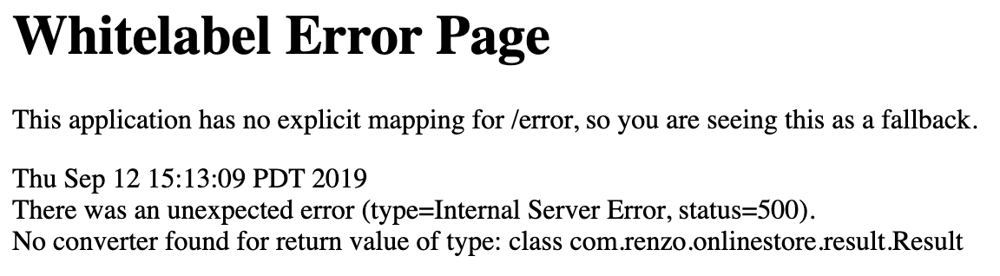

# QuickBuy
Self-made online shopping mall 

## 1 Project Setup
### 1.1 Project Initialization
Go to [spring boot starter website](https://start.spring.io) and initialize the project shown below

Place MainApplication.java under main package for package scanning

### 1.2 Necessary Encapsulation
#### 1.2.1 Return Object of Controller
Usually our controller will return two types of entity:
1. Rest API Json
````
    Rest {
        "code": 500,
        "msg": "SERVER ERROR",
        "data": XXX
    }
````
We generate a class classed Result and we use enum to pair code and message.
2. Web page

Note:
1. We define our code as 6 digits 100/200-XXX where 100-XXX means successful operation and 200-XXX means failure issue.
2. We use the last three digits to distinguish different components and the detailed rules are below:
    2.1 -1XX used for general session
    2.2 -2XX used for login component
    2.3 -3XX used for product component
    2.4 -4XX used for order component
    
### 1.3 Components Integration
#### [1.3.1 MyBatis](http://www.mybatis.org/spring-boot-starter/mybatis-spring-boot-autoconfigure/)
1. Add mybatis dependency and configure it
2. Add mysql dependency
3. Add druid connection pool dependency and configure

#### 1.3.2 Redis
##### 1. Installation
##### 2. Integrating Redis
1. add Jedis dependency
    1.1 Configure redis in RedisConfig
    1.2 [Create redis service and JedisPoolFactory](https://github.com/xetorthio/jedis)
    1.3 General Cached Key Encapsulation
        interface ==> abstract class ==> class
        expire time 0 means never expiring
2. add Fastjson dependency (readable)

    
    
# Problem
### 1 Return type error shown below

This is because getter methods are missing in Result class so the browser cannot convert it.


    

    


